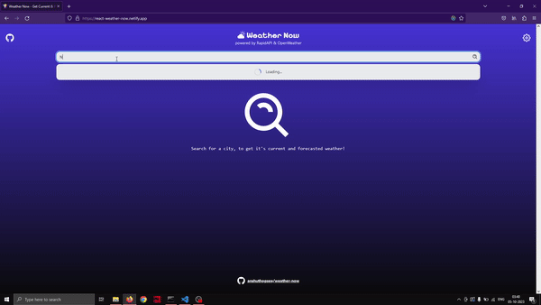

A simple weather app that uses the OpenWeatherMap API to display the current and forecasted weather for a given city. The app has got an autocomplete feature that suggests cities as you type. This app was an experiment with Tailwind CSS and was built using React, and Redux Toolkit.

## Demo

## Features
1. Autocomplete feature that suggests cities as you type with memoization.
2. Displays the current and forecasted weather for a given city.
3. Can  toggle between different units of measurement.

## To be added
1. Persistance of the last searched city, units of measurement using local storage.
2. Option in the settings menu to change the background color of the app.

## Want to run it locally?
1. Clone the repo.
2. Run `npm install` to install all the dependencies.
3. Create a `.env` file in the root directory and add your OpenWeatherMap API key.
3. Run `npm run dev` to start the development server.

## Site link
## https://react-weather-now.netlify.app/